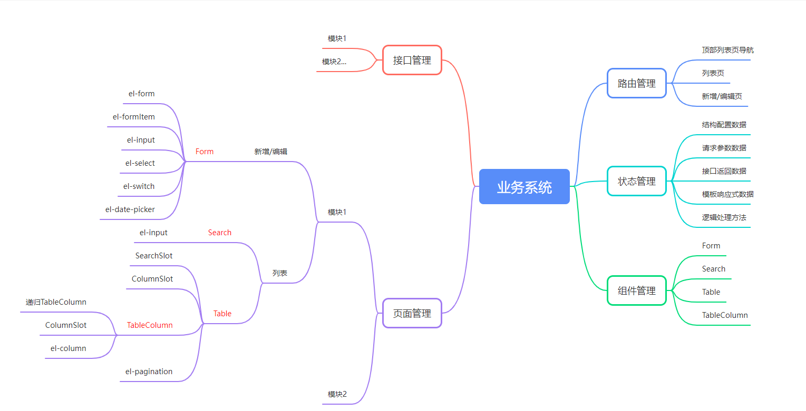
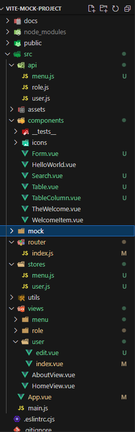

# vite-mock-project

## 页面使用

### 新增模块方法: 以menu模块为例

1. 在router中新增列表及新增修改页面的路由
2. 新增api/menu请求接口, 此处为复用mock数据接口
3. 新增store/menu 容器, 添加基础数据及增删改查处理逻辑, 添加Table及Form组件预配的columns低代码结构配置数据
4. 新增view/menu 页面, 配置store中的数据及方法作为入参传入Table组件, 根据需求自定义表头, 单元格, 样式等内容
5. 新增view/edit页面, 配置store中的数据及方法作为入参传入Form组件, 并可自定义填充示例数据
6. 测试

## 组件设计



## 工作内容



### 以user/index.vue为基础进行以下处理

1. 将页面中耦合的代码逻辑拆分, 将主要方法及变量移入store, 方便拆分后的组件共用数据及逻辑
2. 分析现有功能, 拆分出基础表格组件Table, 基础表单组件Form
3. 将原有页面功能使用组件替换, 并改弹框表单为新页面方式通过路由跳转
4. 改进Table组件功能, 实现课题要求的基础功能,
5. 通过slot实现自定义表头, 行, 列, 单元格. 抽出列组件为可递归的TableColumn组件, 实现多级表头功能
6. 将字段搜索组件抽出为组件Search, 并通过slot方式传递搜索方法, 在页面中自定义配置要搜索的字段
7. 改进Form组件, 支持多种格式的数据输入, 为方便测试增加一键填充示例数据的功能8.改进导航栏, 自动根据路由配置展示列表页面路由导航

## 数据流转

1. 页面初始化, 调用store中配置的请求列表数据接口, 获取tableData数据
2. Tabel组件根据tableData, columns,以及插槽内容, 使用el-table及封装的TableColumn组件 根据不同列的是否有children, 通过TableColumn递归多级表头, 根据每列的type, 或插槽内容渲染主体表格, 分页器, 及字段搜索部分
3. 新增通过按钮触发, 编辑时通过handleEdit, 二者都是跳转路由, 使用Form组件, 根据store中formData初始数据, 新增不带id, 编辑保持id 判断使用新增还是编辑的逻辑进行后续处理
   - 若取消则返回原路由.
   - 若继续, 在用户输入后, 及提交前, 触发表单验证, 若通过, 触发handleConfirm事件, 继而在edit页面触发store中的新增编辑请求处理逻辑, 根据id判断是否修改pageIndex即是否跳回首页, 完成后通过router.push跳转回列表页4.删除功能, 通过触发handleDelete触发store中的删除逻辑, 完成后重新请求列表数据

##

This template should help get you started developing with Vue 3 in Vite.

## Recommended IDE Setup

[VSCode](https://code.visualstudio.com/) + [Volar](https://marketplace.visualstudio.com/items?itemName=Vue.volar) (and disable Vetur) + [TypeScript Vue Plugin (Volar)](https://marketplace.visualstudio.com/items?itemName=Vue.vscode-typescript-vue-plugin).

## Customize configuration

See [Vite Configuration Reference](https://vitejs.dev/config/).

## Project Setup

```sh
pnpm install
```

### Compile and Hot-Reload for Development

```sh
pnpm dev
```

### Compile and Minify for Production

```sh
pnpm build
```

### Run Unit Tests with [Vitest](https://vitest.dev/)

```sh
pnpm test:unit
```

### Lint with [ESLint](https://eslint.org/)

```sh
pnpm lint
```
